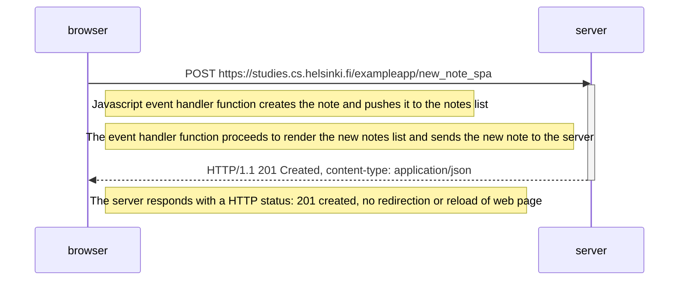

```mermaid
sequenceDiagram
    participant browser
    participant server

    browser->>server: POST https://studies.cs.helsinki.fi/exampleapp/new_note_spa
    activate server

    Note right of browser: Javascript event handler function creates the note and pushes it to the notes list

    Note right of browser: The event handler function proceeds to render the new notes list and sends the new note to the server

    server-->>browser: HTTP/1.1 201 Created, content-type: application/json
    deactivate server

    Note right of browser: The server responds with a HTTP status: 201 created, no redirection or reload of web page
```
