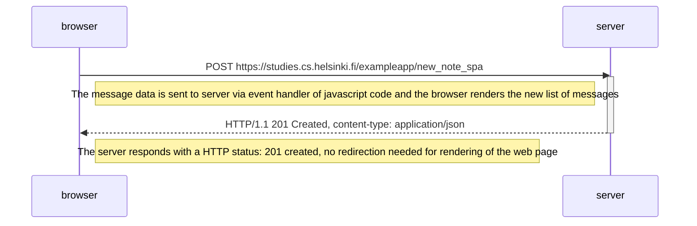

```mermaid
sequenceDiagram
    participant browser
    participant server

    browser->>server: POST https://studies.cs.helsinki.fi/exampleapp/new_note_spa
    activate server

    Note right of browser: The message data is sent to server via event handler of javascript code and the browser renders the new list of messages

    server-->>browser: HTTP/1.1 201 Created, content-type: application/json
    deactivate server

    Note right of browser: The server responds with a HTTP status: 201 created, no redirection needed for rendering of the web page
```
